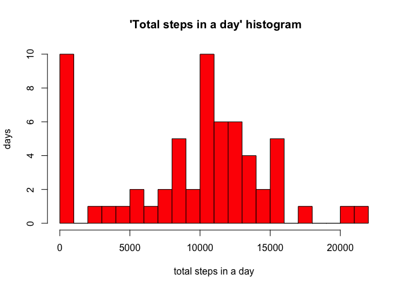
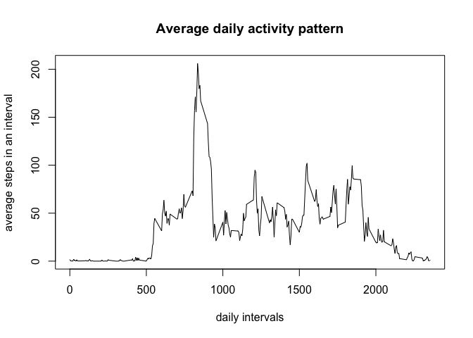
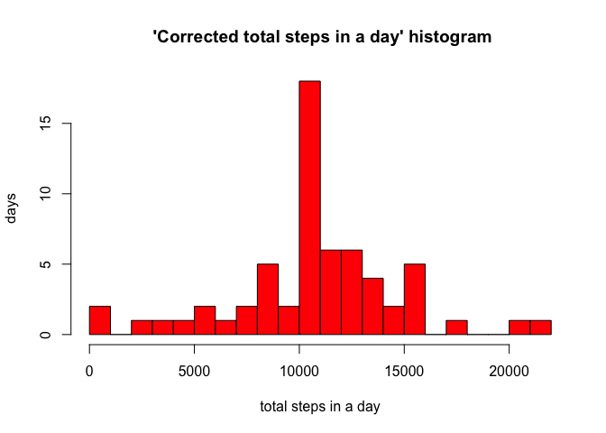
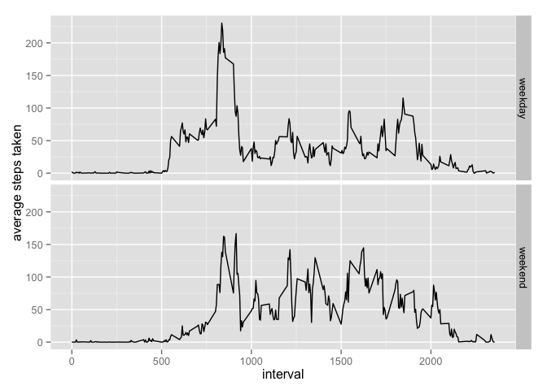

# Reproducible Research: Peer Assessment 1


## Loading and preprocessing the data

Using dplyr and lubridate packages to manipulate data and dates and times.

```r
activitydata<-read.csv("activity.csv")
library(dplyr)
```

```
## 
## Attaching package: 'dplyr'
## 
## The following object is masked from 'package:stats':
## 
##     filter
## 
## The following objects are masked from 'package:base':
## 
##     intersect, setdiff, setequal, union
```

```r
library(lubridate)
activity<-tbl_df(activitydata)
activity
```

```
## Source: local data frame [17,568 x 3]
## 
##    steps       date interval
## 1     NA 2012-10-01        0
## 2     NA 2012-10-01        5
## 3     NA 2012-10-01       10
## 4     NA 2012-10-01       15
## 5     NA 2012-10-01       20
## 6     NA 2012-10-01       25
## 7     NA 2012-10-01       30
## 8     NA 2012-10-01       35
## 9     NA 2012-10-01       40
## 10    NA 2012-10-01       45
## ..   ...        ...      ...
```

## What is mean total number of steps taken per day?

Converting the date column from character to a POSIXct POSIXt class


```r
activity<-mutate(activity,date=ymd(date))
activity
```

```
## Source: local data frame [17,568 x 3]
## 
##    steps       date interval
## 1     NA 2012-10-01        0
## 2     NA 2012-10-01        5
## 3     NA 2012-10-01       10
## 4     NA 2012-10-01       15
## 5     NA 2012-10-01       20
## 6     NA 2012-10-01       25
## 7     NA 2012-10-01       30
## 8     NA 2012-10-01       35
## 9     NA 2012-10-01       40
## 10    NA 2012-10-01       45
## ..   ...        ...      ...
```
To calculate total steps taken in a day, the data need to be grouped by date


```r
by_date<-group_by(activity,date)
by_date
```

```
## Source: local data frame [17,568 x 3]
## Groups: date
## 
##    steps       date interval
## 1     NA 2012-10-01        0
## 2     NA 2012-10-01        5
## 3     NA 2012-10-01       10
## 4     NA 2012-10-01       15
## 5     NA 2012-10-01       20
## 6     NA 2012-10-01       25
## 7     NA 2012-10-01       30
## 8     NA 2012-10-01       35
## 9     NA 2012-10-01       40
## 10    NA 2012-10-01       45
## ..   ...        ...      ...
```

To plot a hsitogram of total steps taken in a day, we remove NAs and summarize the data after adding up the number of steps taken in a day


```r
steps_in_day<-summarize(by_date,steps_total=sum(steps,na.rm=TRUE))
head(steps_in_day) 
```

```
## Source: local data frame [6 x 2]
## 
##         date steps_total
## 1 2012-10-01           0
## 2 2012-10-02         126
## 3 2012-10-03       11352
## 4 2012-10-04       12116
## 5 2012-10-05       13294
## 6 2012-10-06       15420
```
We then plot the histogram


```r
hist(steps_in_day$steps_total,col="red",breaks=20,main=" 'Total steps in a day' histogram",xlab="total steps in a day",ylab="days")
```

 

To calculate mean total steps in a day


```r
mean_total_steps_daily<-summarize(steps_in_day,mean_steps=mean(steps_total, na.rm=TRUE))
mean_total_steps_daily
```

```
## Source: local data frame [1 x 1]
## 
##   mean_steps
## 1    9354.23
```
The mean total steps taken daily are: 9354.2295082

To calculate median total steps in a day


```r
median_total_steps_daily<-summarize(steps_in_day,median_steps=median(steps_total, na.rm=TRUE))
median_total_steps_daily
```

```
## Source: local data frame [1 x 1]
## 
##   median_steps
## 1        10395
```
The median total steps daily are : 10395

## What is the average daily activity pattern?

To find ot the daily pattern of activity, we need to group activity data by interval and then find out the mean of steps in each interval


```r
by_interval<-group_by(activity,interval)
by_interval
```

```
## Source: local data frame [17,568 x 3]
## Groups: interval
## 
##    steps       date interval
## 1     NA 2012-10-01        0
## 2     NA 2012-10-01        5
## 3     NA 2012-10-01       10
## 4     NA 2012-10-01       15
## 5     NA 2012-10-01       20
## 6     NA 2012-10-01       25
## 7     NA 2012-10-01       30
## 8     NA 2012-10-01       35
## 9     NA 2012-10-01       40
## 10    NA 2012-10-01       45
## ..   ...        ...      ...
```

```r
daily_pattern<-summarize(by_interval,steps_mean=mean(steps,na.rm=TRUE))
daily_pattern
```

```
## Source: local data frame [288 x 2]
## 
##    interval steps_mean
## 1         0  1.7169811
## 2         5  0.3396226
## 3        10  0.1320755
## 4        15  0.1509434
## 5        20  0.0754717
## 6        25  2.0943396
## 7        30  0.5283019
## 8        35  0.8679245
## 9        40  0.0000000
## 10       45  1.4716981
## ..      ...        ...
```

We then plot the data


```r
plot(daily_pattern,type='l',main="Average daily activity pattern",xlab="daily intervals",ylab="average steps in an interval")
```

 

To find the interval with maximum average daily activity we filter the daily pattern data


```r
average_daily_max_activity_interval<-filter(daily_pattern,steps_mean==max(steps_mean))
average_daily_max_activity_interval
```

```
## Source: local data frame [1 x 2]
## 
##   interval steps_mean
## 1      835   206.1698
```
The interval with on average maximum activity is 835


## Imputing missing values

To calculate the number of rows with NA's we filter the data


```r
narows<-filter(activity,is.na(steps))
narows
```

```
## Source: local data frame [2,304 x 3]
## 
##    steps       date interval
## 1     NA 2012-10-01        0
## 2     NA 2012-10-01        5
## 3     NA 2012-10-01       10
## 4     NA 2012-10-01       15
## 5     NA 2012-10-01       20
## 6     NA 2012-10-01       25
## 7     NA 2012-10-01       30
## 8     NA 2012-10-01       35
## 9     NA 2012-10-01       40
## 10    NA 2012-10-01       45
## ..   ...        ...      ...
```

The number of rows with NAs is 2304

We will subsitute NA's in the data with the mean of steps taken in the corresponding intervals where a step count is available; we will call this corrected data as 'activity2'


```r
activity2<-activity
for (i in seq_along(activity2$steps)){
if (is.na(activity2$steps[i])==TRUE){
activity2$steps[i]=daily_pattern$steps_mean[which(daily_pattern$interval==activity2$interval[i])]}
}
activity2
```

```
## Source: local data frame [17,568 x 3]
## 
##        steps       date interval
## 1  1.7169811 2012-10-01        0
## 2  0.3396226 2012-10-01        5
## 3  0.1320755 2012-10-01       10
## 4  0.1509434 2012-10-01       15
## 5  0.0754717 2012-10-01       20
## 6  2.0943396 2012-10-01       25
## 7  0.5283019 2012-10-01       30
## 8  0.8679245 2012-10-01       35
## 9  0.0000000 2012-10-01       40
## 10 1.4716981 2012-10-01       45
## ..       ...        ...      ...
```

As before, to calculate total steps taken in a day, the data need to be grouped by date subsittuting the appropriate data


```r
by_date_2<-group_by(activity2,date)
by_date_2
```

```
## Source: local data frame [17,568 x 3]
## Groups: date
## 
##        steps       date interval
## 1  1.7169811 2012-10-01        0
## 2  0.3396226 2012-10-01        5
## 3  0.1320755 2012-10-01       10
## 4  0.1509434 2012-10-01       15
## 5  0.0754717 2012-10-01       20
## 6  2.0943396 2012-10-01       25
## 7  0.5283019 2012-10-01       30
## 8  0.8679245 2012-10-01       35
## 9  0.0000000 2012-10-01       40
## 10 1.4716981 2012-10-01       45
## ..       ...        ...      ...
```

To plot a histogram of total steps taken in a day, we summarize the data after adding up the number of steps taken in a day


```r
steps_in_day_2<-summarize(by_date_2,steps_total=sum(steps,na.rm=TRUE))
head(steps_in_day_2)
```

```
## Source: local data frame [6 x 2]
## 
##         date steps_total
## 1 2012-10-01    10766.19
## 2 2012-10-02      126.00
## 3 2012-10-03    11352.00
## 4 2012-10-04    12116.00
## 5 2012-10-05    13294.00
## 6 2012-10-06    15420.00
```
We then plot the histogram


```r
hist(steps_in_day_2$steps_total,col="red",breaks=20,main=" 'Corrected total steps in a day' histogram",xlab="total steps in a day",ylab="days")
```

 

To calculate mean total steps in a day


```r
mean_total_steps_daily_2<-summarize(steps_in_day_2,mean_steps=mean(steps_total, na.rm=TRUE))
mean_total_steps_daily_2
```

```
## Source: local data frame [1 x 1]
## 
##   mean_steps
## 1   10766.19
```
The corrected mean total steps taken daily are: 1.0766189\times 10^{4}

To calculate median total steps in a day


```r
median_total_steps_daily_2<-summarize(steps_in_day_2,median_steps=median(steps_total, na.rm=TRUE))
median_total_steps_daily_2
```

```
## Source: local data frame [1 x 1]
## 
##   median_steps
## 1     10766.19
```
The corrected median total steps daily are : 1.0766189\times 10^{4}

Q: Do these values differ from the estimates in the first part of the assignment?
A: The corrected mean is greater than the original uncorrected mean where as the corrected median is almost identical to the uncorrected median. This suggests that the median is a more robust statistic for a given dataset.

## Are there differences in activity patterns between weekdays and weekends?

We first add an additional column to the corrected data to give us the day of the week for each row.


```r
activity2<-mutate(activity2,day=wday(date))
```
We then add another column that indicates whether the given day falls on a weekend or is a weekday


```r
activity2<-activity2 %>% mutate(weekday=ifelse(day==2|day==3|day==4|day==5|day==6,"weekday","weekend"))
activity2
```

```
## Source: local data frame [17,568 x 5]
## 
##        steps       date interval day weekday
## 1  1.7169811 2012-10-01        0   2 weekday
## 2  0.3396226 2012-10-01        5   2 weekday
## 3  0.1320755 2012-10-01       10   2 weekday
## 4  0.1509434 2012-10-01       15   2 weekday
## 5  0.0754717 2012-10-01       20   2 weekday
## 6  2.0943396 2012-10-01       25   2 weekday
## 7  0.5283019 2012-10-01       30   2 weekday
## 8  0.8679245 2012-10-01       35   2 weekday
## 9  0.0000000 2012-10-01       40   2 weekday
## 10 1.4716981 2012-10-01       45   2 weekday
## ..       ...        ...      ... ...     ...
```

To calculate daily activity pattern on weekdays and weekends, we manipulate the data further to finally end up with a table that has average steps in every interval on weekdays and weekends


```r
av_steps_weekday<-activity2 %>% filter(weekday=="weekday") %>% group_by(interval) %>% summarize(mean_steps=mean(steps)) %>% mutate(weekday="weekday")
av_steps_weekday
```

```
## Source: local data frame [288 x 3]
## 
##    interval mean_steps weekday
## 1         0 2.25115304 weekday
## 2         5 0.44528302 weekday
## 3        10 0.17316562 weekday
## 4        15 0.19790356 weekday
## 5        20 0.09895178 weekday
## 6        25 1.59035639 weekday
## 7        30 0.69266247 weekday
## 8        35 1.13794549 weekday
## 9        40 0.00000000 weekday
## 10       45 1.79622642 weekday
## ..      ...        ...     ...
```

```r
av_steps_weekend<-activity2 %>% filter(weekday=="weekend") %>%
group_by(interval) %>% summarize(mean_steps=mean(steps)) %>% mutate(weekday="weekend")
av_steps_weekend
```

```
## Source: local data frame [288 x 3]
## 
##    interval  mean_steps weekday
## 1         0 0.214622642 weekend
## 2         5 0.042452830 weekend
## 3        10 0.016509434 weekend
## 4        15 0.018867925 weekend
## 5        20 0.009433962 weekend
## 6        25 3.511792453 weekend
## 7        30 0.066037736 weekend
## 8        35 0.108490566 weekend
## 9        40 0.000000000 weekend
## 10       45 0.558962264 weekend
## ..      ...         ...     ...
```

```r
av_steps<-rbind(av_steps_weekday,av_steps_weekend)
av_steps
```

```
## Source: local data frame [576 x 3]
## 
##    interval mean_steps weekday
## 1         0 2.25115304 weekday
## 2         5 0.44528302 weekday
## 3        10 0.17316562 weekday
## 4        15 0.19790356 weekday
## 5        20 0.09895178 weekday
## 6        25 1.59035639 weekday
## 7        30 0.69266247 weekday
## 8        35 1.13794549 weekday
## 9        40 0.00000000 weekday
## 10       45 1.79622642 weekday
## ..      ...        ...     ...
```
To plot the data we need the ggplot2 library

```r
library(ggplot2)
qplot(interval,mean_steps,data=av_steps,geom="line",facets=weekday~., ylab="average steps taken")
```

 

We can see that the weekday activity has a peak of activity during the early part of day whereas activity is more sustained during the entire day on weekends.

